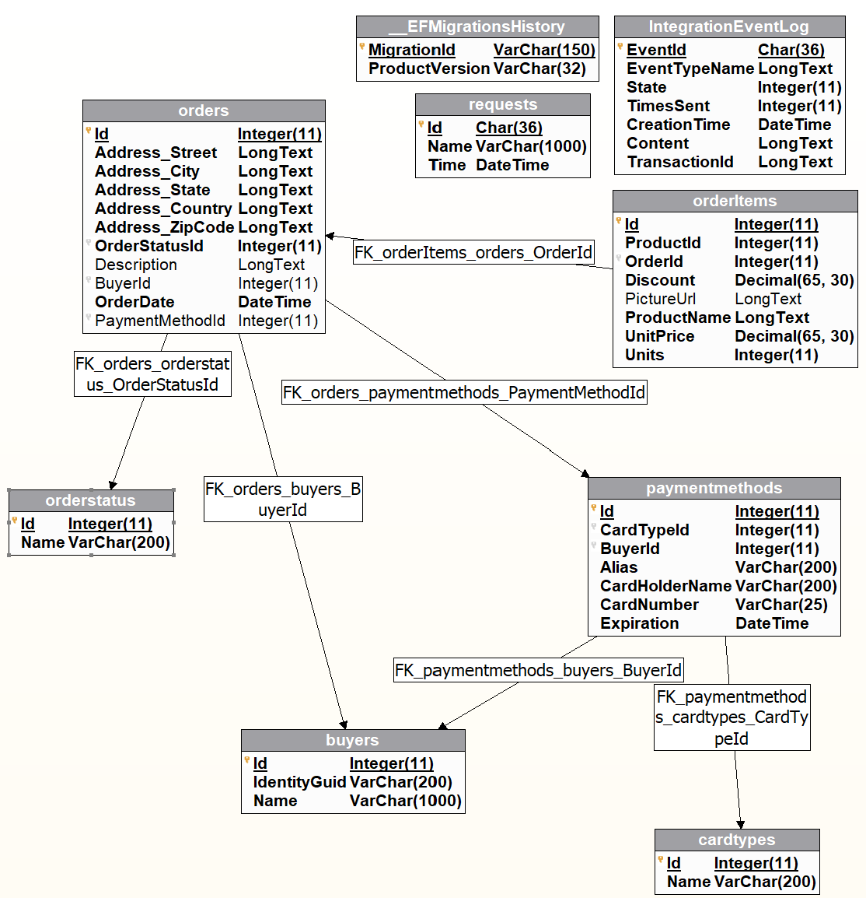

# 'Me', a technology demonstration

A project to demonstrate full-stack aspects of a microservice based solution hosted in Azure.

## Environment
- [Azure Container Apps](https://learn.microsoft.com/en-us/azure/container-apps/) - IaaS, easy orchestration, scalable, pay-as-you-go. NET Core 8.x preview
- [Azure API Management](https://azure.microsoft.com/en-us/products/api-management/)
- Docker Container Registry
- GitHub Actions CI/CD
- [AAD B2C](https://learn.microsoft.com/en-us/azure/active-directory-b2c/) - Customer identity access management (CIAM). 
- Azure Blob Storage - login customization
- MariaDb Container App service for demo purposes
- RabbitMQ Event Bus Container App service for demo purposes
- Redis Container App service for demo purposes
- Angular v16 SPA with Tailwind CSS
- Stripe for order checkout (currently by redirect)
- gRPC - [restricted in Azure Container Apps](https://github.com/microsoft/azure-container-apps/issues/763)
- SignalR - connected with login. [APIM limitations with consumption plans](https://learn.microsoft.com/en-us/azure/api-management/websocket-api?tabs=portal)

## Bicep provisioning

<h1>Notes</h1>
<ul>
<li>The steps below were established on a Windows 10 machine</li>
<li>The Azure resources can be configured to auto scale based upon demand</li>
<li>Global scaling can be configured using a geode or stamped pattern</li>
</ul>

<h2>Currently working on</h2>
<ul> 
<li><a href="https://green-wave-08182290f.3.azurestaticapps.net">Fulfillment webhooks</a> <-- Link to current version
<li>Azure hosting for demo is configured with free or consumption plans, some of which scale to 0 when unused. Initial perfomance might lag as services "wake up".</li>
</ul>

<h1>Deploying Me</h1>

<h2>Local</h2>

After cloning Me

<pre><code>docker-compose up
cd Frontends/Angular/Me
npm install
npm run start (for Node server)
npm run swa   (for Azure Static Web App emulator)
</code></pre>
<h2>Azure</h2>

<h3>Prereqs</h3>

Deploying Me to Azure requires:

<ol type="1">
<li> Azure account <a href="https://azure.microsoft.com/en-us/free/search/?ef_id=_k_4fffd49be29e1baacc4bb019e2ee66a6_k_&OCID=AIDcmm5edswduu_SEM__k_4fffd49be29e1baacc4bb019e2ee66a6_k_&msclkid=4fffd49be29e1baacc4bb019e2ee66a6">(Free is fine)</a></li>
<li> <a href="https://learn.microsoft.com/en-us/cli/azure/install-azure-cli">[az CLI]</a></li>
</ol>

<h3>Fork Me</h3>

Me uses GitHub Actions for CI/CD so you'll need your own copy

After provisioning the Me infrastructure (below) we'll configure the GitHub environment to enable Actions to deploy the Container Apps and Angular frontends.

<h3>Clone Me</h3>

So you can run the scripts

<h3>Push initial images to Docker</h3>

Upload to Docker a "latest" version of the initial images. The provisioning that follows will pull them and import the APIs into APIM.

<pre><code>./uploadDockerImages.ps1 <i>your-docker-login</i>
</code></pre>

<h3>Provision Me</h3>

Create the Azure infrastructure for Me in an Azure Resource Group of your choosing1. Confirm the Azure resources are all available in the location you choose (I used eastus).

<pre><code>az configure --defaults group=<i>your-resource-group</i>
az deployment group create --template-file bicep/main.bicep
</code></pre>

Note: AAD B2C infrastructure is not yet part of automated provisioning. It requires manual provision and config. (claims, apis, scopes)

<h3>GitHub Actions CI/CD Repository Secrets</h3>

The following Repository Secrets support CI/CD deployments:

<ul>
<li><a href="https://docs.docker.com/docker-hub/access-tokens/">DOCKERHUB_TOKEN</a> - Container images will be pushed to Docker</li>
<li>DOCKERHUB_USERNAME</li>
<li>AZURE_SUBSCRIPTION_ID - Azure Container App Revisions will pull images from Docker (Supports OIDC login)</li>
<li>AZURE_TENANT_ID - (Supports OIDC login)</li>
<li><a href="https://learn.microsoft.com/en-us/azure/static-web-apps/deployment-token-management">STATIC_WEB_APP_DEPLOY_TOKEN</a></li>
</ul>

<h3>GitHub Actions CI/CD Environment Secrets (dev)</h3>

The following Environment Secrets support the beginning of CI/CD dev/prod isolation

<ul>
<li>AZURE_CLIENT_ID - User Assigned Identity "uai-GitHubOIDC" provisioned above -> Settings -> Properties</li>
<li>STORAGE_ACCOUNT_KEY - For login customization deployment</li>
</ul>

<h3>Testing</h3>
<ul>
<li>Verify the .github/*.yml env variables match your configuration</li>
<li>You might want to comment out "on: push: paths:" from GitHub yml files to force CI/CD to run</li>
<li>Test APIs that were imported into APIM</li>
<li>Open Container App console in Azure portal and curl the APIs, view the logs. The Container Apps are configured to scale to 0. An APIM call will wake them.</li>
<li>Navigate to your static web app.</li>
</ul>

<h2>That's it so far</h2>

Container Apps Environment is external. Container Apps ingress is limited to APIM and internal container services. The containers have curl installed for quick API checks but you can change ingress to allow public access. EventBus and gRPC enable inter-service communication. APIM connects to the Container Apps as Backend Services. CORS is handled in APIM.

<h2>TO DO</h2>
<ul>
<li>Improve mobile UI</li>
<li>Fulfillment integration</li>
<li>Full catalog with paging, eliminate dead links</li>
<li>Customize profile form?</li>
<li>Script AAD-B2C environment provisioning</li>
<li>Implement semantic-release versioning</li>
</ul>

## Purchase database

  
1 The Azure Container Apps Managed Environment creates an additional Resource Group for Kubernetes that it controls